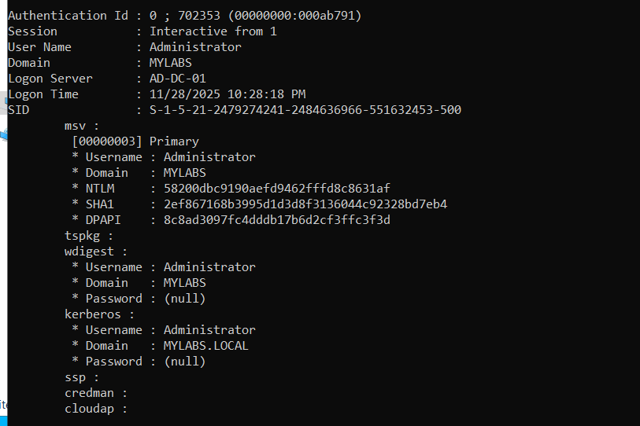

# Active Directory Attack & Defense Lab 🛡️⚔️

## 📝 Project Overview
This project simulates a real-world cyberattack on an enterprise Active Directory (AD) environment to understand the complete lifecycle of an identity-based attack. 

The goal was to establish a vulnerable AD infrastructure, execute a **Credential Dumping** attack using Mimikatz, and engineer a robust detection pipeline using **Sysmon** and **Wazuh SIEM**. This lab demonstrates the specific telemetry required to detect advanced threats that often bypass standard antivirus solutions.

## 🏗️ Technical Architecture
* **Hypervisor:** VMware Workstation
* **Server Infrastructure:** Windows Server 2022 (Domain Controller: `AD-DC-01`)
* **Client Infrastructure:** Windows 11 Enterprise (`Victim-PC`)
* **Defense Stack:**
    * **Telemetry:** Sysmon (System Monitor) v15.0
    * **SIEM:** Wazuh v4.7 (Manager on Ubuntu, Agents on Windows)
* **Offensive Tools:** Mimikatz (Credential Dumping & Pass-the-Hash)

---

## 🏴‍☠️ Phase 1: The Attack (Red Team)
**Objective:** Compromise the Domain Controller and extract Administrator credentials.

After deploying the Active Directory environment (`mylabs.local`), I simulated an adversary with local administrative access executing **Mimikatz** to harvest credentials from memory (`LSASS.exe`).

### Attack Execution (MITRE T1003.001)
I executed the `sekurlsa::logonpasswords` command to dump NTLM hashes. As shown below, I successfully extracted the NTLM hash for the **Administrator** account, which grants total control over the domain.

*Figure 1: Successful extraction of the Domain Admin NTLM hash using Mimikatz.*

---

## 🛡️ Phase 2: Telemetry & Log Analysis
**Objective:** Identify the attack footprint in raw logs.

Standard Windows Event Logs often fail to capture the granular details of process injection. I implemented **Sysmon** with a hardened configuration to capture **Event ID 1 (Process Creation)**. 

This allowed me to see the exact command line arguments and the file path of the malicious binary (`C:\Safe\mimikatz_trunk\x64\mimikatz.exe`) before it was ingested by the SIEM.

*Figure 2: Sysmon Event ID 1 capturing the execution of the Mimikatz binary.*

---

## ⚙️ Phase 3: Detection Engineering
**Objective:** Create a high-fidelity alert to detect this threat in real-time.

By default, Wazuh logs this event but does not classify it as a critical threat. To fix this, I engineered a **Custom XML Detection Rule** to correlate specific patterns in the Sysmon logs.

### Custom Rule Logic
I wrote the following logic in `local_rules.xml` to trigger a **Level 10 Alert** whenever the image name matches `mimikatz.exe` (case-insensitive regex).

*Figure 3: Custom XML rule configured on the Wazuh Manager to detect T1003 techniques.*

---

## 🚨 Phase 4: The Result
**Objective:** Verify the defense pipeline.

Upon re-executing the attack, the SIEM pipeline worked perfectly:
1.  **Sysmon** generated the log.
2.  **Wazuh Agent** shipped the log to the Manager.
3.  **Custom Rule 100002** triggered immediately.

*Figure 4: Critical Security Alert triggered on the Wazuh Dashboard immediately after the attack.*

---

## 🧠 Key Skills Demonstrated
* **Identity Security:** Understanding NTLM authentication, LSASS, and Pass-the-Hash (PtH) attacks.
* **SIEM Administration:** Deploying Wazuh agents and managing log ingestion pipelines.
* **Detection Engineering:** Writing custom XML rules using Regex to reduce false negatives.
* **Endpoint Visibility:** Configuring Sysmon to bridge the gap in standard Windows logging.
